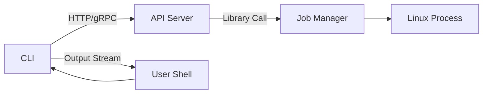

# Goal

Create a prototype job worker service that allows clients to:

Submit arbitrary Linux commands via an API.

Monitor their execution.

Stop running jobs.

The solution includes asynchronous process execution, job status tracking, and API endpoints for user interaction.

# Scope

Start/stop jobs with configurable commands, arguments.

Track job status (e.g., running, exited).

Stream stdout/stderr.

Apply resource limits via cgroups.

Non-Goals

Authentication/Authorization: Assumes a trusted network.

Persistent storage: All job tracking is done in-memory.

# Approach

The system provides a set of API endpoints to:

1. Create new jobs.
2. Monitor job status.
3. Stream job output.
4. Stop running jobs.
5. Jobs are managed in memory and executed asynchronously in isolated Linux processes with configurable runtime constraints.

# Architecture

# RPC

service JobService {
  rpc StartJob(StartJobRequest) returns (StartJobResponse);
  rpc StopJob(JobRequest) returns (JobResponse);
  rpc GetStatus(JobRequest) returns (JobStatusResponse);
  rpc StreamOutput(JobRequest) returns (stream JobOutputChunk);
}

message StartJobRequest {
  string command = 1;
  repeated string args = 2;
    }

message StartJobResponse {
  string job_id = 1;
}

message JobRequest {
  string job_id = 1;
}

message JobResponse {
  bool success = 1;
  string message = 2;
}

message JobStatusResponse {
  string job_id = 1;
  string status = 2; // "running", "exited"
  int32 exit_code = 3;
}

message JobOutputChunk {
  bytes data = 1;
  string stream = 2; // "stdout" or "stderr"
}

# Storage
Since we are not going to use any database to store the information. We use HashMap to store all the information. We use HashMap instead of others like list or array. Because of two reason, first we don't know the size of storage should be flexible, we don't know how much job we are going to have and how long are we going to keep them. Second, we should quickly find out those jobs, because we have a rpc to search the job.

# TLS Configuration

We use TLS 1.3. Cipher suites are standardized and will be used by default. I thought we should save username and token for the request, but that will make the system more complicated. I just keep the certificate for security.
Certificate Setup
Server requires:

Server certificate signed by a trusted internal CA. Client certificate presented during the TLS handshake.

Clients must:

Present a valid client certificate issued by the same trusted CA. Have their Subject fields or SANs matched against a static authorization whitelist.

Certificate Validation Process
The server verifies:

    1.The client's certificate is signed by the trusted CA.

    2.The certificate is valid (not expired or revoked).

    3.The Subject CN or SAN matches an allowed client identity.

The client verifies:

1. The server's certificate is signed by the trusted CA.

2. The server certificate matches expected identity (e.g., hostname).

# Resource Control 

we will use Linux Control Groups (cgroups v2).

Each job will be placed into its own cgroup, with configurable limits for:

1. CPU usage (e.g., CPU shares, quota)

2. Memory usage (e.g., max memory limit)

3. Disk IO (e.g., read/write bandwidth and IOPS)

cgroups Setup

The API server will programmatically create a new cgroup for each job under a fixed cgroup hierarchy (e.g., /sys/fs/cgroup/worker_jobs/).

Each job will have a unique sub-cgroup named after its job_id.

After starting the Linux process, the server assigns the process PID to its corresponding cgroup.

